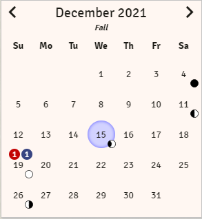
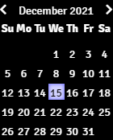
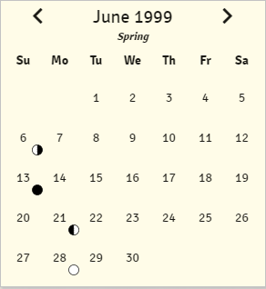

# Simple Calendar API

There are the functions that other modules, systems and macros can access and what they can do. Most of these are for advanced interfacing with Simple Calendar and not something everyone needs to worry about.

Simple Calendar exposes a variable called `SimpleCalendar`, all of these API functions exist the property api on that variable `SimpleCalendar.api`

## Properties
- [Calendars](#simplecalendarapicalendars)
- [DateSelectorPositions](#simplecalendarapidateselectorpositions)
- [LeapYearRules](#simplecalendarapileapyearrules)
- [MoonIcons](#simplecalendarapimoonicons)
- [MoonYearResetOptions](#simplecalendarapimoonyearresetoptions)
- [PresetTimeOfDay](#simplecalendarapipresettimeofday)
- [YearNamingRules](#simplecalendarapiyearnamingrules)

## Functions
- [activateFullCalendarListeners](#simplecalendarapiactivatefullcalendarlistenerscalendarid-onmonthchange-ondayclick)
- [advanceTimeToPreset](#simplecalendarapiadvancetimetopresetpreset)
- [changeDate](#simplecalendarapichangedateinterval)
- [chooseRandomDate](#simplecalendarapichooserandomdatestartdate-enddate)
- [clockStatus](#simplecalendarapiclockstatus)
- [configureCalendar](#simplecalendarapiconfigurecalendarconfig)
- [dateToTimestamp](#simplecalendarapidatetotimestampdate)
- [formatDateTime](#simplecalendarapiformatdatetimedate)
- [getAllMonths](#simplecalendarapigetallmonths)
- [getAllMoons](#simplecalendarapigetallmoons)
- [getAllSeasons](#simplecalendarapigetallseasons)
- [getAllWeekdays](#simplecalendarapigetallweekdays)
- [getCurrentDay](#simplecalendarapigetcurrentday)
- [getCurrentMonth](#simplecalendarapigetcurrentmonth)
- [getCurrentSeason](#simplecalendarapigetcurrentseason)
- [getCurrentWeekday](#simplecalendarapigetcurrentweekday)
- [getCurrentYear](#simplecalendarapigetcurrentyear)
- [getLeapYearConfiguration](#simplecalendarapigetleapyearconfiguration)
- [getTimeConfiguration](#simplecalendarapigettimeconfiguration)
- [isPrimaryGM](#simplecalendarapiisprimarygm)
- [secondsToInterval](#simplecalendarapisecondstointervalseconds)
- [setDate](#simplecalendarapisetdatedate)
- [showCalendar](#simplecalendarapishowcalendardate-compact)
- [timestamp](#simplecalendarapitimestamp)
- [startClock](#simplecalendarapistartclock)
- [stopClock](#simplecalendarapistopclock)
- [timestampPlusInterval](#simplecalendarapitimestampplusintervaltimestamp-interval)
- [timestampToDate](#simplecalendarapitimestamptodatetimestamp)

## Handlebar Helpers
- [sc-date-selector](#sc-date-selector)
- [sc-full-calendar](#sc-full-calendar)

## Types
- [Calendar Configuration Object](#calendar-configuration-object)
- [Current Date Object](#current-date-object)
- [Date Object](#date-object)
- [Date Display Object](#date-display-object)
- [Date Time Object](#date-time-object)
- [Day Object](#day-object)
- [First New Moon Object](#first-new-moon-object)
- [Interval Time Object](#interval-time-object)
- [Leap Year Object](#leap-year-object)
- [Month Object](#month-object)
- [Moon Object](#moon-object)
- [Moon Phase Object](#moon-phase-object)
- [Note Category Object](#note-category-object)
- [Season Object](#season-object)
- [Time Object](#time-object)
- [Weekday Object](#weekday-object)
- [Year Object](#year-object)

# Properties

## `SimpleCalendar.api.Calendars`

This is an enum that contains a list of all available predefined calendars within Simple Calendar.

**Important**: This is a list of keys used internally to determine which Predefined calendar should be used it does not return an object containing the configuration for a predefined calendar.

## `SimpleCalendar.api.DateSelectorPositions`

This is an enum that contains a list of all the position settings that can be used for the date selector input.

- **Auto**: Let the Date Selector choose the best position. This is the default option.
- **LeftDown**: The Date Selector will have its left edge inline with the left edge of the input and will open up below the input.
- **LeftUp**: The Date Selector will have its left edge inline with the left edge of the input and will open up above the input.
- **RightDown**: The Date Selector will have its right edge inline with the right edge of the input and will open up below the input.
- **RightUp**: The Date Selector will have its right edge inline with the right edge of the input and will open up above the input.

## `SimpleCalendar.api.LeapYearRules`

This is an enum that contains the options for how leap years are calculated. Options are:
 - **None**: No leap year rules
 - **Gregorian**: Follow the Gregorian leap year rules
 - **Custom**: Set up custom leap year rules

## `SimpleCalendar.api.MoonIcons`

This is an enum that contains a list of all available icons for moon phases.

## `SimpleCalendar.api.MoonYearResetOptions`

This is an enum that contains the options for when a moons first new moon year should be reset. Options are:

- **None**: The moons first new moon year is never reset.
- **Leap Year**: The moons first new moon year is reset every leap year.
- **X Years**: The moons first new moon year is reset every X years.

## `SimpleCalendar.api.PresetTimeOfDay`

This is an enum that contains the different preset times that can be used to set the time of day. Options are:

- **Midnight**: The beginning of the day. Equates to time 0.
- **Sunrise**: When the sun rises above the horizon. Equates to the sunrise time as defined by the seasons.
- **Midday**: The middle of the day. Equates to the middle of the day, 12 for most calendars.
- **Sunset**: When the sun sets below the horizon. Equates to the sunset time as defined by the seasons.

## `SimpleCalendar.api.YearNamingRules`

This is an enum that contains the options for how year names are applied to years. Options are:

- **Default**: From the year name starting year the names will be applied in order. When names run out no names will be used.
- **Repeat**: From the year name starting year the names will be applied in order. When names run out the list will repeat from the beginning.
- **Random**: Every year will be giving a random year name from the list.

# Functions

## `SimpleCalendar.api.activateFullCalendarListeners(calendarId, onMonthChange, onDayClick)`

This function is used to activate event listeners for calendars displayed with the [sc-full-calendar](#sc-full-calendar) Handlebar helper.

If being used in a FoundryVTT application or FormApplication it is best called in the activateListeners function.

### Parameters

Parameter|Type|Default Value|Description
---------|-----|-------------|-----------
calendarId|String|N/A|The ID of the HTML element of the calendar to activate listeners for. This is the same ID used in the [sc-full-calendar](#sc-full-calendar) Handlebar helper.
onMonthChange|Function or Null|null|Optional function to be called when the month being viewed has changed. Returned parameters to the function are:<br/> - The direction moved, previous or next.<br/> - The options used to render the calendar, which includes the date being shown.
onDayClick|Function or Null|null|Optional function to be called when a day is clicked. Returned parameters to the function are:<br/>- The options used to render the calendar, which includes the selected date.

### Examples

```javascript
MainApp.api.activateFullCalendarListeners('example_1');
```

## `SimpleCalendar.api.advanceTimeToPreset(preset)`

Advance the date and time to match the next preset time.

**Important**: This function can only be run by users who have permission to change the date in Simple Calendar.

### Parameters

Parameter|Type|Default Value|Description
---------|-----|-------------|-----------
preset|[PresetTimeOfDay](#simplecalendarapipresettimeofday)|undefined|The preset time that is used to set the time of day.

### Returns

This function will return true if the date was set successfully, false if it was not.

### Examples

```javascript
//Assuming the curent time is 11am, set the time to the next sunset
//Will result in the date staying the same but the time changing to 6pm
MainApp.api.advanceTimeToPreset(MainApp.api.PresetTimeOfDay.Sunset);

//Assuming the current time is 11am, set the time to the next sunrise
//Will result in the date advancing by 1 day and the time changing to 6am
MainApp.api.advanceTimeToPreset(MainApp.api.PresetTimeOfDay.Sunrise);
```

<hr/>

## `SimpleCalendar.api.changeDate(interval)`

Changes the current date of Simple Calendar.

**Important**: This function can only be run by users who have permission to change the date in Simple Calendar.

### Parameters

Parameter|Type|Default Value|Description
---------|-----|-------------|-----------
interval|[Interval Time Object](#interval-time-object)|No Default|The interval objects properties are all optional so only those that are needed have to be set.<br/>Where each property is how many of that interval to change the current date by.

### Returns

This function will return true if the date change was successful and false if it was not.

### Examples

```javascript
//Assuming a date of June 1, 2021 and user has permission to change the date
MainApp.api.changeDate({day: 1}); // Will set the new date to June 2, 2021

//Assuming a date of June 1, 2021 and user has permission to change the date
MainApp.api.changeDate({day: -1}); // Will set the new date to May 31, 2021

//Assuming a date of June 1, 2021 10:00:00 and user has permission to change the date
MainApp.api.changeDate({year: 1, month: 1, day: 1, hour: 1, minute: 1, second: 1}); // Will set the new date to July 2, 2022 11:01:01

//Assuming a date of June 1, 2021 10:00:00 and user has permission to change the date
MainApp.api.changeDate({second: 3600}); // Will set the new date to June 1, 2021 11:00:00
```

<hr/>

## `SimpleCalendar.api.chooseRandomDate(startDate, endDate)`

Will choose a random date between the 2 passed in dates, or if no dates are passed in will choose a random date.

### Parameters

Parameter|Type|Default Value|Description
---------|-----|-------------|-----------
startDate|[Date Time Object](#date-time-object)|{}|The start date objects properties are all optional so only those needed have to be set.<br/>Where each property is the earliest date to be chosen when randomly selecting a date.<br/>The month and day properties are both index's so January would be 0 and the first day of the month is also 0.
endDate|[Date Time Object](#date-time-object)|{}|The end date objects properties are all optional so only those needed have to be set.<br/>Where each property is the latest date to be chosen when randomly selecting a date.<br/>The month and day properties are both index's so January would be 0 and the first day of the month is also 0.

### Returns
The [Date Time Object](#date-time-object) returned has the following properties

Property|Type|Default Value|Description
---------|-----|-------------|-----------
year|Number|0|The randomly selected year
month|Number|0|The randomly selected month index
day|Number|0|The randomly selected day index
hour|Number|0|The randomly selected hour
minute|Number|0|The randomly selected minute
second|Number|0|The randomly selected second

### Examples

```javascript
MainApp.api.chooseRandomDate({year: 2021, month: 3, day: 0}, {year: 2021, month: 5, day: 1})
/*
{
    day: 1
    hour: 12
    minute: 5
    month: 4
    second: 41
    year: 2021
}
 */

MainApp.api.chooseRandomDate({year: 1900, month: 3}, {year: 2021, month: 5})
/*
{
    day: 19
    hour: 8
    minute: 16
    month: 3
    second: 25
    year: 1982
}
*/

MainApp.api.chooseRandomDate();
/*
{
    day: 11
    hour: 0
    minute: 49
    month: 8
    second: 37
    year: 3276
}
 */
```

<hr/>

## `SimpleCalendar.api.clockStatus()`

Will get the current status of the built-in clock in Simple Calendar

### Returns

The returned object has the following properties:

Property|Type|Description
---------|-----|-----------
started|Boolean|If the clock has started and is running.
stopped|Boolean|If the clock is stopped and not running.
paused|Boolean|If the clock has paused. The clock will be paused when the game is paused or the active scene has an active combat.

### Examples

```javascript
const status = MainApp.api.clockStatus();
console.log(status); // {started: false, stopped: true, paused: false}
```

<hr/>

## `SimpleCalendar.api.configureCalendar(config)`

Sets up the current calendar to match the passed in configuration. This function can only be run by GMs.

### Parameters

Parameter|Type|Default Value|Description
---------|-----|-------------|-----------
config|`SimpleCalendar.api.Calendar` or [Calendar Configuration](#calendar-configuration-object)|undefined|The configuration to set the current year to. It can be one of the predefined calendars or an [Calendar Configuration object](#calendar-configuration-object) representing a custom calendar.


### Returns

Returns a promise that resolves to a boolean value, true if the change was successful and false if it was not.

### Examples

```javascript

//Set the calendar configuration to the Gregorian calendar
const result = await MainApp.api.configureCalendar(MainApp.api.Calendars.Gregorian);

//Set the calendar configuration to a custom calendar
const custom = {};

const result = await MainApp.api.configureCalendar(custom);

```

<hr/>

## `SimpleCalendar.api.dateToTimestamp(date)`

Will convert that passed in date object to a timestamp.

### Parameters

Parameter|Type|Default Value|Description
---------|-----|-------------|-----------
date|[Date Time Ojbect](#date-time-object) or null|null|A date object (eg `{year:2021, month: 4, day: 12, hour: 0, mintue: 0, second: 0}`) with the parameters set to the date that should be converted to a timestamp. Any missing parameters will default to the current date value for that parameter.<br>**Important**: The month and day are index based so January would be 0 and the first day of the month will also be 0.

### Returns

Returns the timestamp for that date.


### Examples

```javascript
MainApp.api.dateToTimestamp({}); //Returns the timestamp for the current date

MainApp.api.dateToTimestamp({year: 2021, month: 0, day: 0, hour: 1, minute: 1, second: 0}); //Returns 1609462860
```

<hr/>

## `SimpleCalendar.api.formatDateTime(date)`

Converts the passed in date into formatted date and time strings that match the configured date and time formats.

### Parameters

Parameter|Type|Default Value|Description
---------|-----|-------------|-----------
date|[Date Time Ojbect](#date-time-object) or null|null|A date object (eg `{year:2021, month: 4, day: 12, hour: 0, mintue: 0, second: 0}`) with the parameters set to the date and time that should be formatted.<br>**Important**: The month and day are index based so January would be 0 and the first day of the month will also be 0.

- Any missing date/time parameters will default to a value of 0.
- If the date/time parameters are negative, their value will be set to 0. The exception to this is the year parameter, it can be negative.
- If the date/time parameters are set to a value greater than possible (eg. the 20th month in a calendar that only has 12 months, or the 34th hour when a day can only have 24 hours) the max value will be used.

### Returns

Returns an object that contains a formatted date string and a formatted time string.

### Examples

```javascript
// Assuming that the default date and time formats are in place
// Date: Full Month Name Day, Year
// Time: 24Hour:Minute:Second

MainApp.api.formatDate({year: 2021, month: 11, day: 24, hour: 12, minute: 13, second: 14});
// Returns {date: 'December 25, 2021', time: '12:13:14'}

MainApp.api.formatDate({year: -2021, month: -11, day: 24, hour: 12, minute: 13, second: 14})
// Returns {date: 'January 25, -2021', time: '12:13:14'}

MainApp.api.formatDate({year: 2021, month: 111, day: 224, hour: 44, minute: 313, second: 314})
// Returns {date: 'December 31, 2021', time: '23:59:59'}
```

<hr/>

## `SimpleCalendar.api.getAllMonths()`

Gets the details for all the months of the calendar.

### Returns

This function returns an array of [Month Objects](#month-object).

### Examples

```javascript
MainApp.api.getAllMonths();
/* Returns an array like this, assuming the Gregorian Calendar
[
    {
        "id": "13390ed",
        "name": "January",
        "abbreviation": "Jan",
        "numericRepresentation": 1,
        "numericRepresentationOffset": 0,
        "numberOfDays": 31,
        "numberOfLeapYearDays": 31,
        "intercalary": false,
        "intercalaryInclude": false,
        "startingWeekday": null
    },
    {
        "id": "effafeee",
        "name": "February",
        "abbreviation": "Feb",
        "numericRepresentation": 2,
        "numericRepresentationOffset": 0,
        "numberOfDays": 28,
        "numberOfLeapYearDays": 29,
        "intercalary": false,
        "intercalaryInclude": false,
        "startingWeekday": null
    },
    {
        "id": "25b48251",
        "name": "March",
        "abbreviation": "Mar",
        "numericRepresentation": 3,
        "numericRepresentationOffset": 0,
        "numberOfDays": 31,
        "numberOfLeapYearDays": 31,
        "intercalary": false,
        "intercalaryInclude": false,
        "startingWeekday": null
    },
    {
        "id": "e5e9782f",
        "name": "April",
        "abbreviation": "Apr",
        "numericRepresentation": 4,
        "numericRepresentationOffset": 0,
        "numberOfDays": 30,
        "numberOfLeapYearDays": 30,
        "intercalary": false,
        "intercalaryInclude": false,
        "startingWeekday": null
    },
    {
        "id": "93f626f6",
        "name": "May",
        "abbreviation": "May",
        "numericRepresentation": 5,
        "numericRepresentationOffset": 0,
        "numberOfDays": 31,
        "numberOfLeapYearDays": 31,
        "intercalary": false,
        "intercalaryInclude": false,
        "startingWeekday": null
    },
    {
        "id": "22b4b204",
        "name": "June",
        "abbreviation": "Jun",
        "numericRepresentation": 6,
        "numericRepresentationOffset": 0,
        "numberOfDays": 30,
        "numberOfLeapYearDays": 30,
        "intercalary": false,
        "intercalaryInclude": false,
        "startingWeekday": null
    },
    {
        "id": "adc0a7ca",
        "name": "July",
        "abbreviation": "Jul",
        "numericRepresentation": 7,
        "numericRepresentationOffset": 0,
        "numberOfDays": 31,
        "numberOfLeapYearDays": 31,
        "intercalary": false,
        "intercalaryInclude": false,
        "startingWeekday": null
    },
    {
        "id": "58197d71",
        "name": "August",
        "abbreviation": "Aug",
        "numericRepresentation": 8,
        "numericRepresentationOffset": 0,
        "numberOfDays": 31,
        "numberOfLeapYearDays": 31,
        "intercalary": false,
        "intercalaryInclude": false,
        "startingWeekday": null
    },
    {
        "id": "eca76bbd",
        "name": "September",
        "abbreviation": "Sep",
        "numericRepresentation": 9,
        "numericRepresentationOffset": 0,
        "numberOfDays": 30,
        "numberOfLeapYearDays": 30,
        "intercalary": false,
        "intercalaryInclude": false,
        "startingWeekday": null
    },
    {
        "id": "6b0da33e",
        "name": "October",
        "abbreviation": "Oct",
        "numericRepresentation": 10,
        "numericRepresentationOffset": 0,
        "numberOfDays": 31,
        "numberOfLeapYearDays": 31,
        "intercalary": false,
        "intercalaryInclude": false,
        "startingWeekday": null
    },
    {
        "id": "150f5519",
        "name": "November",
        "abbreviation": "Nov",
        "numericRepresentation": 11,
        "numericRepresentationOffset": 0,
        "numberOfDays": 30,
        "numberOfLeapYearDays": 30,
        "intercalary": false,
        "intercalaryInclude": false,
        "startingWeekday": null
    },
    {
        "id": "b67bc3ee",
        "name": "December",
        "abbreviation": "Dec",
        "numericRepresentation": 12,
        "numericRepresentationOffset": 0,
        "numberOfDays": 31,
        "numberOfLeapYearDays": 31,
        "intercalary": false,
        "intercalaryInclude": false,
        "startingWeekday": null
    }
]
 */
```

<hr/>

## `SimpleCalendar.api.getAllMoons()`

Gets the details for all the moons of the calendar.

### Returns

This function returns an array of [Moon Objects](#moon-object).

### Examples

```javascript
MainApp.api.getAllMoons();
/* Returns an array like this, assuming the Gregorian Calendar
[
    {
        "id": "2c26abfa",
        "name": "Moon",
        "color": "#ffffff",
        "cycleLength": 29.53059,
        "cycleDayAdjust": 0.5,
        "firstNewMoon": {
            "year": 2000,
            "month": 1,
            "day": 6,
            "yearX": 0,
            "yearReset": "none"
        },
        "phases": [
            {
                "name": "New Moon",
                "length": 1,
                "icon": "new",
                "singleDay": true
            },
            {
                "name": "Waxing Crescent",
                "length": 6.3826,
                "icon": "waxing-crescent",
                "singleDay": false
            },
            {
                "name": "First Quarter",
                "length": 1,
                "icon": "first-quarter",
                "singleDay": true
            },
            {
                "name": "Waxing Gibbous",
                "length": 6.3826,
                "icon": "waxing-gibbous",
                "singleDay": false
            },
            {
                "name": "Full Moon",
                "length": 1,
                "icon": "full",
                "singleDay": true
            },
            {
                "name": "Waning Gibbous",
                "length": 6.3826,
                "icon": "waning-gibbous",
                "singleDay": false
            },
            {
                "name": "Last Quarter",
                "length": 1,
                "icon": "last-quarter",
                "singleDay": true
            },
            {
                "name": "Waning Crescent",
                "length": 6.3826,
                "icon": "waning-crescent",
                "singleDay": false
            }
        ],
        "currentPhase": {
            "name": "Waning Crescent",
            "length": 6.3826,
            "icon": "waning-crescent",
            "singleDay": false
        }
    }
]
 */
```

<hr/>

## `SimpleCalendar.api.getAllSeasons()`

Gets the details for all the seasons for the calendar.

### Returns

This function returns an array of [Season objects](#season-object).

### Examples

```javascript
MainApp.api.getAllSeasons();
/* Returns an array like this, assuming the Gregorian Calendar
[
    {
        color: "#fffce8",
        id: "4916a231",
        name: "Spring",
        startingDay: 20,
        startingMonth: 3,
        sunriseTime: 21600,
        sunsetTime: 64800
    },
    {
        color: "#f3fff3",
        id: "e596489",
        name: "Summer",
        startingDay: 20,
        startingMonth: 6,
        sunriseTime: 21600,
        sunsetTime: 64800
    },
    {
        color: "#fff7f2",
        id: "3f137ee5",
        name: "Fall",
        startingDay: 22,
        startingMonth: 9,
        sunriseTime: 21600,
        sunsetTime: 64800
    },
    {
        color: "#f2f8ff",
        id: "92f919a2",
        name: "Winter",
        startingDay: 21,
        startingMonth: 12,
        sunriseTime: 21600,
        sunsetTime: 64800
    }
]
 */
```

<hr/>

## `SimpleCalendar.api.getAllWeekdays`

Gets the details about all the weekdays for the calendar.

### Returns

This function returns an array of [Weekday Object](#weekday-object).

### Examples

```javascript
MainApp.api.getAllWeekdays();
/* Returns an array like this, assuming the Gregorian Calendar
[
    {
        id: "dafbfd4",
        name: "Sunday",
        numericRepresentation: 1
    },
    {
        id: "8648c7e9",
        name: "Monday",
        numericRepresentation: 2
    }
    {
        id: "b40f3a20",
        name: "Tuesday",
        numericRepresentation: 3
    },
    {
        id: "6c20a99e",
        name: "Wednesday",
        numericRepresentation: 4
    },
    {
        id: "56c14ec7",
        name: "Thursday",
        numericRepresentation: 5
    },
    {
        id: "2c732d04",
        name: "Friday",
        numericRepresentation: 6
    },
    {
        id: "c8f72e3d",
        name: "Saturday",
        numericRepresentation: 7
    }
]
 */
```

<hr/>

## `SimpleCalendar.api.getCurrentDay()`

Gets the details about the current day.

### Returns

This function returns a [Day Object](#day-object).

### Examples

```javascript
MainApp.api.getCurrentDay();
/* Returns an object like this:
{
    id: "cbdb31cb",
    name: "8",
    numericRepresentation: 8
}
 */
```

<hr/>

## `SimpleCalendar.api.getCurrentMonth()`

Gets the details about the current month.

### Returns

This function returns a [Month Object](#month-object).

### Examples

```javascript
MainApp.api.getCurrentMonth();
/* Returns an object like this:
{
    abbreviation: "Jun",
    id: "22b4b204",
    intercalary: false,
    intercalaryInclude: false,
    name: "June",
    numberOfDays: 30,
    numberOfLeapYearDays: 30,
    numericRepresentation: 6,
    numericRepresentationOffset: 0,
    startingWeekday: null
}
 */
```

<hr/>

## `SimpleCalendar.api.getCurrentSeason()`

Gets the details about the season for the current date of the calendar.

### Returns

This function returns a [Season Object](#season-object).

### Examples

```javascript
MainApp.api.getCurrentSeason();
/* Returns an object like this
{
    color: "#fffce8",
    id: "4916a231",
    name: "Spring",
    startingDay: 19,
    startingMonth: 2,
    sunriseTime: 21600,
    sunsetTime: 64800
}
*/
```

<hr/>

## `SimpleCalendar.api.getCurrentWeekday()`

Gets the details about the current weekday.

### Returns

This function returns a [Weekday Object](#weekday-object).

### Examples

```javascript
MainApp.api.getCurrentWeekday();
/* Returns an object like this
{
    id: "b40f3a20",
    name: "Tuesday",
    numericRepresentation: 3
}
*/
```

<hr/>

## `SimpleCalendar.api.getCurrentYear()`

Gets the details about the current year.

### Returns

This function returns a [Year Object](#year-object).

### Examples

```javascript
MainApp.api.getCurrentYear();
/* Returns an object like this
{
    firstWeekday: 4,
    id: "bbe5385c",
    numericRepresentation: 2021,
    postfix: "",
    prefix: "",
    showWeekdayHeadings: true,
    yearNames: [],
    yearNamesStart: 0,
    yearNamingRule: "default",
    yearZero: 1970
}
*/
```

<hr/>

## `SimpleCalendar.api.getLeapYearConfiguration()`

Gets the details about how leap years are configured for the calendar.

### Returns

This function returns a [Leap Year Object](#leap-year-object).

### Examples

```javascript
MainApp.api.getLeapYearConfiguration();
/* Returns an object like this
{
    customMod: 0,
    id: "1468d034",
    rule: "gregorian"
}
*/
```

<hr/>

## `SimpleCalendar.api.getTimeConfiguration()`

Get the details about how time is configured for the calendar.

### Returns

This function returns a [Time Object](#time-object).

### Examples

```javascript
MainApp.api.getTimeConfiguration();
/* Returns an object like this
{
    gameTimeRatio: 1,
    hoursInDay: 24,
    id: "d4791796",
    minutesInHour: 60,
    secondsInCombatRound: 6,
    secondsInMinute: 60,
    unifyGameAndClockPause: true,
    updateFrequency: 1
}
*/
```

<hr/>

## `SimpleCalendar.api.isPrimaryGM()`

Returns if the current user is considered the primary GM or not.

### Examples

```javascript

MainApp.api.isPrimaryGM(); //True or Flase depending on if the current user is primary gm

```

<hr/>

## `SimpleCalendar.api.secondsToInterval(seconds)`

Will attempt to parse the passed in seconds into larger time intervals that make it up.

### Parameters

Parameter|Type|Default Value|Description
---------|-----|-------------|-----------
seconds|Number|No Default|The number of seconds to convert to different intervals.

### Returns

Returns an [Interval Time Object](#interval-time-object).

### Examples

```javascript
//Assuming a Gregorian Calendar
MainApp.api.secondsToInterval(3600); //Returns {year: 0, month: 0, day: 0, hour: 1, minute: 0, second 0}
MainApp.api.secondsToInterval(3660); //Returns {year: 0, month: 0, day: 0, hour: 1, minute: 1, second: 0}
MainApp.api.secondsToInterval(86400); //Returns {year: 0, month: 0, day: 1, hour: 0, minute: 0, second: 0}
MainApp.api.secondsToInterval(604800); //Returns {year: 0, month: 0, day: 7, hour: 0, minute: 0, second: 0}
MainApp.api.secondsToInterval(2629743); //Returns {year: 0, month: 1, day: 0, hour: 10, minute: 29, second: 3}
MainApp.api.secondsToInterval(31556926); //Returns {year: 1, month: 0, day: 0, hour: 5, minute: 48, second: 46}
```

<hr/>

## `SimpleCalendar.api.setDate(date)`

Will set the current date to the passed in date.

**Important**: This function can only be run by users who have permission to change the date in Simple Calendar.

### Parameters

Parameter|Type|Default Value|Description
---------|-----|-------------|-----------
date|[Date Time Object](#date-time-object) or null|null|A date object (eg `{year:2021, month: 4, day: 12, hour: 0, mintue: 0, second: 0}`) with the parameters set to the date that the calendar should be set to. Any missing parameters will default to the current date value for that parameter.<br>**Important**: The month and day are index based so January would be 0 and the first day of the month will also be 0.

### Returns

This function will return true if the date was set successfully, false if it was not.

### Examples

```javascript
//To set the date to December 25th 1999 with the time 00:00:00
MainApp.setDateTime(1999, 11, 24);

//To set the date to December 31st 1999 and the time to 11:59:59pm
MainApp.setDateTime(1999, 11, 30, 23, 59, 59);
```

<hr/>

## `SimpleCalendar.api.showCalendar(date, compact)`

Will open up Simple Calendar to the current date, or the passed in date.

### Parameters

Parameter|Type|Default Value|Description
---------|-----|-------------|-----------
date|[Date Time Object](#date-time-object) or null|null|A date object (eg `{year:2021, month: 4, day: 12}`) with the year, month and day set to the date to be visible when the calendar is opened.<br>**Important**: The month is index based so January would be 0.
compact|boolean|false|If to open the calendar in compact mode or not.

### Examples

```javascript
//Assuming a Gregorian Calendar
MainApp.api.showCalendar(); // Will open the calendar to the current date.
MainApp.api.showCalendar({year: 1999, month: 11, day: 25}); // Will open the calendar to the date December 25th, 1999
MainApp.api.showCalendar(null, true); // Will opent the calendar to the current date in compact mode.
```

<hr/>

## `SimpleCalendar.api.startClock()`

Starts the real time clock of Simple Calendar. Only the primary GM can start a clock.

### Returns

Will return true if the clock started, false if it did not.

### Examples

```javascript
MainApp.api.startClock();
```

<hr/>

## `SimpleCalendar.api.stopClock()`

Stops the real time clock of Simple Calendar.

### Returns

Will return true if the clock stopped, false if it did not.

### Examples

```javascript
MainApp.api.stopClock();
```

<hr/>

## `SimpleCalendar.api.timestamp()`

Return the timestamp (in seconds) of the calendars currently set date.

### Examples

```javascript
const timestamp = MainApp.api.timestamp();
console.log(timestamp); // This will be a number representing the current number of seconds passed in the calendar.
```

<hr/>

## `SimpleCalendar.api.timestampPlusInterval(timestamp, interval)`

Returns the current timestamp plus the passed in interval amount.

### Parameters

Parameter|Type|Default Value|Description
---------|-----|-------------|-----------
timestamp|Number| No Default |The timestamp (in seconds) to have the interval added too.
interval|[Interval Time Object](#interval-time-object)|No Default|The interval objects properties are all optional so only those needed have to be set.<br/>Where each property is how many of that interval to increase the passed in timestamp by.

### Examples

```javascript
let newTime = MainApp.api.timestampPlusInterval(0, {day: 1});
console.log(newTime); // this will be 0 + the number of seconds in 1 day. For most calendars this will be 86400

// Assuming Gregorian Calendar with the current date of June 1, 2021
newTime = MainApp.api.timestampPlusInterval(1622505600, {month: 1, day: 1});
console.log(newTime); // This will be the number of seconds that equal July 2nd 2021
```

<hr/>

## `SimpleCalendar.api.timestampToDate(timestamp)`

Takes in a timestamp (in seconds) and will return that as a Simple Calendar date object.

### Parameters

Parameter|Type|Default Value|Description
---------|-----|-------------|-----------
timestamp|Number| No Default |The timestamp (in seconds) to convert into a date object.

### Returns

A [Date Object](#date-object) is returned.


### Examples

```javascript
// Assuming Gregorian Calendar with the current date of June 1, 2021
let scDate = MainApp.api.timestampToDate(1622505600);
console.log(scDate);
/* This is what the returned object will look like
{
    currentSeason: {color: "#fffce8", startingMonth: 3, startingDay: 20, name: "Spring"},
    day: 0,
    dayDisplay: "1",
    dayOfTheWeek: 2,
    dayOffset: 0,
    display: {
        date: "June 01, 2021",
        day: "1",
        daySuffix: "st",
        month: "6",
        monthName: "June",
        time: "00:00:00",
        weekday: "Tuesday",
        year: "2021",
        yearName: "",
        yearPostfix: "",
        yearPrefix: "",
    },
    hour: 0,
    minute: 0,
    month: 5,
    monthName: "June",
    second: 0,
    showWeekdayHeadings: true,
    weekdays: ["Sunday", "Monday", "Tuesday", "Wednesday", "Thursday", "Friday", "Saturday"],
    year: 2021,
    yearName: "",
    yearPostfix: "",
    yearPrefix: "",
    yearZero: 1970
}
*/
```

# Handlebar Helpers

Simple Calendar registers Handlebar Helpers that can be used by other modules or systems. Please make sure Simple Calendar has finished being initialized before attempting to use these helpers.

## sc-date-selector

This handlebar helper is used to generate the interactive date/time selector tool used throughout Simple Calendar. The date selector will match the configured calendar allowing for a very easy way to choose a date and/or time.

### Parameters

The following parameters can be passed in with the handlebar helper to customize how the date selector functions:

Parameter|Type|Default Value|Description
---------|-----|-------------|-----------
allowDateRangeSelection|Boolean|`false`|If true will allow a range of dates to be selected on the calendar. If false only a single date can be chosen.
allowTimeRangeSelection|Boolean|`false`|If true will allow a start and end time to be chosen. If false only a single time can be selected.
onDateSelect|Function or null|`null`|This is the function to call with the results of a date/time being selected in the date selector. The function will be passed a [Date Selector Result](#date-selector-result) object with the selected date(s) set. 
position|[DateSelectorPositions](#simplecalendarapidateselectorpositions)|`SimpleCalendar.api.DateSelectorPositions.Auto`|How to position the date selector when it is opened from the input.
selectedEndDate|[DateTime](#date-time-object)|`{year: 0, month: 1, day: 1, hour: 0, minute: 0}`|This is used for the ending date and/or time that is selected in the date selector. In single date/time mode this value is ignored.
selectedStartDate|[DateTime](#date-time-object)|`{year: 0, month: 1, day: 1, hour: 0, minute: 0}`|This is used for the starting date and/or time that is selected in the date selector.
showCalendarYear|Boolean|`true`|If true the year will be shown at the top of the calendar display for the date selector. If false the year will not be shown.
showDateSelector|Boolean|`true`|If true the calendar will be shown to allow for the selection of one or more dates. If false the calendar will not be shown.
showTimeSelector|Boolean|`true`|If true the inputs for selecting a time or range of time will be shown. If false  the time selection inputs will not be shown.
timeDelimiter|String|`'-'`|This is the text that is used between the start and end time of a time range.
timeSelected|Boolean|`true`|If a time or time range have been selected. If true the time inputs will appear filled with the selected times. If false the "Add Time" button will appear.

### Styling

To use the default styles for the date selector be sure to add the class `simple-calendar` to the div that contains this handlebar helper. If this is not included then you will be responsible for creating the styles for the date selector.

### Examples

## sc-full-calendar

This handlebar helper is used to generate the HTML for displaying a full calendar view for the current date or a passed in date.

Don't forget to call the [SimpleCalendar.api.activateFullCalendarListeners](#simplecalendarapiactivatefullcalendarlistenerscalendarid-onmonthchange-ondayclick) function for any calendars that should be interactive. Static displays do not need to call this function.

A unique ID is required to ensure proper functionality of a Calendar added with this Handlebar helper.

### Parameters

The following parameters can be passed in with the handlebar helper to customize how the full view looks

Parameter|Type|Default Value|Description
---------|-----|-------------|-----------
allowChangeMonth|Boolean|`true`|If to allow months to be changed on this display
colorToMatchSeason|Boolean|`true`|If to color the background of the calendar to match the color of the season the date falls on.
cssClasses|String|`""`|Any custom CSS classes to add to the wrapper div around the calendar.
date|`{year: number, month: number}`|Current Date| The year and the month index to display for the full calendar view.
id|String|`""`|The unique ID to set to the calendar HTML.
showCurrentDate|Boolean|`true`|If to highlight the current date on the calendar.
showSeasonName|Boolean|`true`|If to show the season name in the calendar view.
showNoteCount|Boolean|`true`|If to show the indicator for notes on the days being displayed.
showMoonPhases|Boolean|`true`|If to show the moon phases for the days being displayed.
showYear|Boolean|`true`|If to show the year in the header text of the full calendar.

### Styling

To use the default styles for the full calendar be sure to add the class `simple-calendar` to the div that contains this handlebar helper. If this is not included then you will be responsible for creating the styles for the calendar.

Inspecting the calendar output is the best way to start customizing the styling!

Default Styles|Custom Style Example
--------------|--------------------
|

### Examples

Assuming the Gregorian calendar with a current date of December 15th, 2021 for all examples

#### Default

```html
{{sc-full-calendar id='custom_id'}}
```


#### All Options Disabled

```html
{{sc-full-calendar id='custom_id' colorToMatchSeason=false showCurrentDate=false showSeasonName=false showNoteCount=false showMoonPhases= false showYear=false}}
```


#### Specific Date Set

Assumes that there is a variable called newDate that looks like this:
```javascript
let newDate = {
    year: 1999,
    month: 5
};
```
```html
{{sc-full-calendar id='custom_id' date=newDate }}
```


# Types

## Calendar Configuration Object

This type contains all information for configuring a calendar.

Property|Type|Optional|Default|Description
--------|-----|-------|------|-----------
currentDate|[Current Date Object](#current-date-object)|Yes|{}|The current date of the calendar.
leapYearSettings|[Leap Year Object](#leap-year-object)|Yes|{}| The leap year settings for the calendar.
monthSettings|Array<[Month Object](#month-object)>|Yes|[]| An array of month settings for the calendar.
moonSettings|Array<[Moon Object](#moon-object)>|Yes|[]| An array of moon settings for the calendar.
noteCategories|Array<[Note Cateogry Object](#note-category-object)>|Yes|[]| An array of note categories for the calendar.
seasonSettings|Array<[Season Object](#season-object)>|Yes|[]|An array of season for the calendar.
timeSettings|[Time Object](#time-object)|Yes|{}| The time settings for the calendar.
weekdaySettings|Array<[Weekday Object](#weekday-object)>|Yes|[]| An array of weekday settings for the calendar.
yearSettings|[Year Object](#year-object)|Yes|{}| The year settings for the calendar.

## Current Date Object

This type contains information on the current date.

Property|Type|Optional|Default|Description
--------|-----|-------|------|-----------
year|Number|No|0|The current year.
month|Number|No|1|The current month's numeric representation.
day|Number|No|1|The current day's numeric representation.
seconds|Number|No|0|The current number of seconds passed in the current day.

## Date Object

This type contains the current date information

Property|Type|Default Value|Description
---------|-----|-------------|-----------
currentSeason|[Season Object](#season-object)|{}|The information for the season of the date, properties include "name" for the seasons name and "color" for the color associated with the season.
day|Number|0|The index of the day of the month represented in the timestamp.
dayOfTheWeek|Number|0|The day of the week the day falls on.
dayOffset|Number|0|The number of days that the months days are offset by.
display|[Date Display Object](#date-display-object)|{}|All of the strings associated with displaying the date are put here
hour|Number|0|The hour represented in the timestamp.
isLeapYear|Boolean|false|If this date falls on a leap year.
midday|Number|0|The timestamp of when midday occurs for this date.
minute|Number|0|The minute represented in the timestamp.
month|Number|0|The index of the month represented in the timestamp.
second|Number|0|The seconds represented in the timestamp.
showWeekdayHeadings|Boolean|true|If to show the weekday headings for the month.
sunrise|Number|0|The timestamp of when the sun rises for this date.
sunset|Number|0|The timestamp of when the sun sets for this date.
weekdays|String Array|[]|A list of weekday names.
year|Number|0|The year represented in the timestamp.
yearZero|Number|0|What is considered as year zero when doing timestamp calculations.


## Date Display Object

This type contains the formatted strings used to display the current date and time.

Property|Type|Default Value|Description
---------|-----|-------------|-----------
date|String|""|The formatted date string based on the format set in the configuration for the date.
day|String|""|How the day is displayed, generally its number on the calendar.
daySuffix|String|""|The Ordinal Suffix associated with the day number (st, nd, rd or th)
month|String|""|The month number.
monthName|String|""|The name of the month.
time|String|''|The formatted time string based on the format set in the configuration for the time.
weekday|String|""|The name of the weekday this date falls on.
year|String|""|The year number
yearName|String|""|The name of the year, if year names have been set up.
yearPostfix|String|""|The postfix value for the year
yearPrefix|String|""|The prefix value for the year

## Date Selector Result

This type represents the results object returned when date/time has been selected using a date selector.

Property|Type|Optional|Default|Description
--------|-----|-------|------|-----------
endDate|[Date Time Object](#date-time-object)|No|N/A|The end date and/or time that was selected from the date selector. In single date/time mode this value will be the same as the start date.
startDate|[Date Time Object](#date-time-object)|No|N/A|The start date and/or time that was selected from the date selector.
timeSelected|Boolean|No|N/A|If a time was selected in the date selector.

## Date Time Object

This type is used to indicate dates and times.

Property|Type|Optional|Default|Description
--------|-----|-------|------|-----------
year|Number|Yes|0|The year for the date time.
month|Number|Yes|0|The month for the date time. **Importat**: The month is index based, meaning the first month of a year will have a value of 0.
day|Number|Yes|0|The day for the date time. **Important**: The day is index based, meaning the first day of the month will have a value of 0.
hour|Number|Yes|0|The hour for the date time.
minute|Number|Yes|0|The minute for the date time.
second|Number|Yes|0|The second for the date time.

## Day Object

This object contains information about a day

Property|Type|Optional|Default|Description
--------|-----|-------|------|-----------
id|String|No|""|The unique ID associated with this day object.
name|String|No|""|The name of the day, at the moment it is just the day number in string form.
numericRepresentation|Number|No|1|The number associated with the day

## First New Moon Object

This type is used to configure when the first new moon for a moon was.

Property|Type|Optional|Default|Description
--------|-----|-------|------|-----------
yearReset|[MoonYearResetOptions](#simplecalendarapimoonyearresetoptions)|No|`SimpleCalendar.api.MoonYearResetOptions.None`|If and when the year of the new moon should be reset.
yearX|Number|No|0|Reset the new moon year every X years.
year|Number|No|0|The year of the first new moon.
month|Number|No|1|The month of the first new moon.
day|Number|No|1|The day of the first new moon.

## Leap Year Object

This type contains information about leap year rules.

Property|Type|Optional|Default|Description
--------|-----|-------|------|-----------
id|String|Yes|""|The unique ID associated with the leap year configuration.
rule|[LeapYearRules](#simplecalendarapileapyearrules)|No|`SimpleCalendar.api.LeapYearRules.None`|This is the leap year rule to follow.
customMod|Number|No|0|The number of years that a leap year happens when the rule is set to 'custom'.

## Interval Time Object

This type is used to indicate intervals of time.

Property|Type|Optional|Default|Description
--------|-----|-------|------|-----------
year|Number|Yes|0|The number of years making up the interval.
month|Number|Yes|0|The number of months making up the interval.
day|Number|Yes|0|The number of days making up the interval.
hour|Number|Yes|0|The number of hours making up the interval.
minute|Number|Yes|0|The number of minutes making up the interval.
second|Number|Yes|0|The number of seconds making up the interval.

## Month Object

This type contains information about a month.

Property|Type|Optional|Default|Description
--------|-----|-------|------|-----------
abbreviation|String|Yes|""|The abbreviated name of the month.
id|String|Yes|""|The unique ID associated with this month.
name|String|No|""|The name of the month.
numericRepresentation|Number|No|1|The number associated with the display of this month.
numericRepresentationOffset|Number|No|0|The amount to offset day numbers by for this month.
numberOfDays|Number|No|0|The number of days this month has during a non leap year.
numberOfLeapYearDays|Number|No|0|The number of days this month has during a leap year.
intercalary|Boolean|No|False|If this month is an intercalary month.
intercalaryInclude|Boolean|No|False|If this month is intercalary then if its days should be included in total day calculations.
startingWeekday|Number or Null|No|Null|The day of the week this month should always start on.

## Moon Object

This type contains information about a moon.

Property|Type|Optional|Default|Description
--------|-----|-------|------|-----------
id|String|Yes|""|The unique ID associated with this season.
color|String|No|"#FFFFFF"|The color associated with the moon.
currentPhase|[Moon Phase Object](#moon-phase-object)|Yes|{}|The moon phase for the current date.
cycleDayAdjust|Number|No|0|A way to nudge the cycle calculations to align with correct dates.
cycleLength|Number|No|0|How many days it takes the moon to complete 1 cycle.
firstNewMoon|[First New Moon Object](#first-new-moon-object)|Yes|{}|When the first new moon was. This is used to calculate the current phase for a given day.
name|String|No|""|The name of the moon.
phases|Array<[Moon Phase Object](#moon-phase-object)>|Yes|[]|The different phases of the moon.

## Moon Phase Object

This type contains information about a moon phase.

Property|Type|Optional|Default|Description
--------|-----|-------|------|-----------
icon|[MoonIcons](#simplecalendarapimoonicons)|No|``|The icon to associate with this moon phase.
length|Number|No|0|How many days of the cycle this phase takes up.
name|String|No|""|The name of the phase.
singleDay|Boolean|No|False|If this phase should only take place on a single day.


## Note Category Object

This type contains information about a note category.

Property|Type|Optional|Default|Description
--------|-----|-------|------|-----------
name|String|No|""|The name of the note category.
color|String|No|""|The background color assigned to the note category.
textColor|String|No|"#FFFFFF"|The color of the text assigned to the note category.

## Season Object

This type contains information about a season.

Property|Type|Default Value|Description
---------|-----|-------------|-----------
color|String|#ffffff|The color associated with this season.
id|String|""|The unique ID associated with this season.
name|String|""|The name of the season.
startingDay|Number|1|The day index of the month that the season starts on.
startingMonth|Number|1|The month index that the season starts on.
sunrise|Number|0|The number of seconds into the starting day of the season that the sun rises. EG. a value of 3600 would be 1:00am in a Gregorian Calendar.
sunset|Number|0|The number of seconds into the starting day of the season that the sun sets. EG. a value of 82800 would be 11:00pm in a Gregorian Calendar.

## Time Object

This type contains information about how time is configured.

Property|Type|Optional|Default|Description
--------|-----|-------|------|-----------
id|String|Yes|""|The unique ID associated with the time configuration.
hoursInDay|Number|No|24|The number of hours in a single day.
minutesInHour|Number|No|60|The number of minutes in a single hour.
secondsInMinute|Number|No|60|The number of seconds in a single minute.
gameTimeRatio|Number|No|1|When running the clock for every second that passes in the real world how many seconds pass in game.
unifyGameAndClockPause|Boolean|No|False|If to start/stop the clock when the game is unpaused/paused.
updateFrequency|Number|No|1|How often (in real world seconds) to update the time while the clock is running.

## Weekday Object

This type contains information about a weekday.

Property|Type|Optional|Default|Description
--------|-----|-------|------|-----------
id|String|Yes|""|The unique ID associated with this weekday.
name|String|No|""|The name of the weekday.
numericRepresentation|Number|No|0|The number representing the weekday.

## Year Object

This type contains information about a year.

Property|Type|Optional|Default|Description
--------|-----|-------|------|-----------
id|String|Yes|""|The unique ID associated with the year.
numericRepresentation|Number|No|0|The number representing the year.
prefix|String|No|""|A string to append to the beginning of a year's number.
postfix|String|No|""|A string to append to the end of a year's number.
showWeekdayHeadings|Boolean|No|True|If to show weekday headings on the calendar.
firstWeekday|Number|No|0|The day of the week the first day of the first month of year zero starts on.
yearZero|Number|No|0|What is considered to be the first year when calculating timestamps.
yearNames|Array<String>|No|[]|A list of names to use for years.
yearNamingRule|[YearNamingRule](#simplecalendarapiyearnamingrules)|No|`SimpleCalendar.api.YearNamingRule.Default`|How to calculate what year name to give to a year.
yearNamesStart|Number|No|0|The year to start applying the year names.
