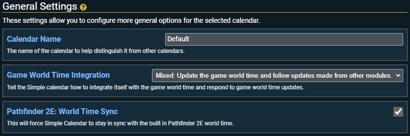

# General Settings

This section contains some general settings that apply across the calendar.

## Calendar Name

What the name of this calendar is. Useful if you have more than one calendar configured.

## Game World Time Integration

These settings dictate how Simple Calendar interacts with Foundry's game world time (the in game clock). Most other modules that have timed events or deal with time tie into the game world time, so it is a great way to keep everything in sync. The different settings for how Simple Calendar can interact with the game world time are:

| Option             | Description                                                                                                                                                                                                                                                                                                                   | Update Game World Time                                           | When Game World Time is Updated                                                                                      |
|--------------------|-------------------------------------------------------------------------------------------------------------------------------------------------------------------------------------------------------------------------------------------------------------------------------------------------------------------------------|------------------------------------------------------------------|----------------------------------------------------------------------------------------------------------------------|
| None               | Simple Calendar does not interact with the game world time at all. This setting is ideal if you want to keep Simple Calendar isolated from other modules.                                                                                                                                                                     | Does not update the game world time                              | Simple Calendar is not updated when the game world time is updated by something else.                                |
| Self               | Treats Simple Calendar as the authority source for the game world time. This setting is ideal when you want Simple Calendar to be in control of the games time and don't want other modules updating Simple Calendar                                                                                                          | Updates the game world time to match what is in Simple Calendar. | Combat round changes will update Simple Calendars time. Simple Calendar will ignore updates from all others modules. |
| Third Party Module | This will instruct Simple Calendar to just display the Time in the game world time. All date changing controls are disabled and the changing of time relies 100% on another module. This setting is ideal if you are just want to use Simple Calenar to display the date in calendar form and/or take advantage of the notes. | Does not update the game world time.                             | Updates it's display everytime the game world time is changed, following what the other modules say the time is.     |
| Mixed (default)    | This option is a blend of the self and third party options. Simple calendar can change the game world time and and changes made by other modules are reflected in Simple Calendar. This setting is ideal if you want to use Simple Calendar and another module to change the game time.                                       | Will update the game world time                                  | Will update it's own time based on changes to the game world time, following what other modules say the time is.     |

Mixed is the best option to ensure compatibility with any other modules that interact with game time.

## Pathfinder 2E: World Clock Sync

:::info
This setting only appears if you are using the **Pathfinder 2E** system.
:::

:::caution Important
Be sure the check-out the [FAQ](../faq#pathfinder-2e) regarding keeping Simple Calendar in sync with the Pathfinder 2E world clock.
:::

This setting will attempt to keep Simple Calendars date and time in sync with the Pathfinder 2E's World Clock.

- The Setting is enabled by default.
- For the **Golarion (Absalom Reckoning)** Date Theme in PF2E's world clock use Simple Calendars **Golarian: Pathfinder 2E** [predefined calendar](quick-setup#choose-a-predefined-calendar).
- For the **Earth (Gregorian)** or **Unthemed (Gregorian)** Date Theme in PF2E's world clock use Simple Calendars **Gregorian** [predefined calendar](quick-setup#choose-a-predefined-calendar).

This setting also forces certain Simple Calendar settings to certain values to ensure the two clocks are in sync.

| Setting                               | PF2E Date Theme              | Value Up To Pathfinder 2E 2.14.4 | Value for Pathfinder 2E 2.15.0 and Later |
|---------------------------------------|------------------------------|----------------------------------|------------------------------------------|
| Leap Year Settings -> Leap Year Rule  | Golarion (Absalom Reckoning) | Gregorian                        | Gregorian                                |
| &nbsp;                                | Earth (Gregorian)            | Gregorian                        | Gregorian                                |
| &nbsp;                                | Unthemed (Gregorian)         | Gregorian                        | Gregorian                                |
| Year Settings -> Year Zero            | Golarion (Absalom Reckoning) | 2700                             | 0                                        |
| &nbsp;                                | Earth (Gregorian)            | 1985                             | 1970                                     |
| &nbsp;                                | Unthemed (Gregorian)         | 1970                             | 1970                                     |
| Weekday Settings -> Starting Week Day | Golarion (Absalom Reckoning) | Starday                          | Starday                                  |
| &nbsp;                                | Earth (Gregorian)            | Thursday                         | Thursday                                 |
| &nbsp;                                | Unthemed (Gregorian)         | Thursday                         | Thursday                                 |
