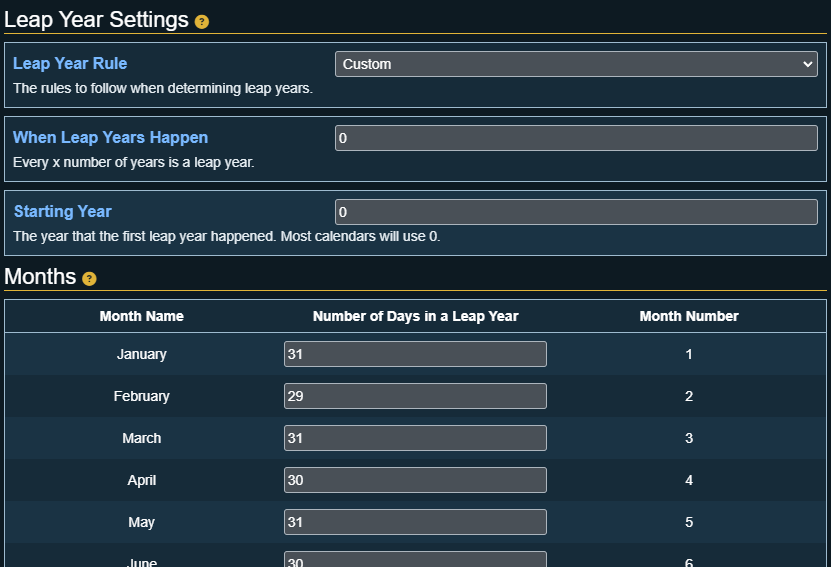

# Leap Year Settings

This section allows for the configuration on how leap years work for this calendar.

## Leap Year Rule

:::caution Important
This setting will be disabled if the [Pathfinder 2E: World Clock Sync](general-settings#pathfinder-2e-world-clock-sync) is enabled!
:::

Which ruleset to follow when determining leap years. The options are: 

- **None**: The calendar contains no leap years
- **Gregorian**: The calendars leap year rules are like the standard calendar (Every year that is exactly divisible by four is a leap year, except for years that are exactly divisible by 100, but these years are leap years if they are exactly divisible by 400)
- **Custom**: Allows you to specify n interval in years for when a leap year happens.

## When Leap Years Happen

:::info
This setting only appears if the [Leap Year Rule](#leap-year-rule) is set to **Custom**.
:::

The number of years when a leap year occurs. Example a value of 5 would mean every 5th year is a leap year.

## Starting Year

The year that the first leap year happened.

An example of this would a calendar that has a leap year every 4 years but the first leap year should be on year 1 and the next on year 5 etc. Setting this option to 1 would allow for this scenario.

## Months

:::info
These settings only appears if the [Leap Year Rule](#leap-year-rule) is set to **Gregorian** or **Custom**.
:::

A list of months will appear that shows each month, and a textbox where you can change the number of days the corresponding month has during a leap year.

:::tip
A month can have 0 leap year days set. If this is set then the month will not appear during leap years, but can appear during non leap years!
:::
