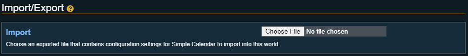
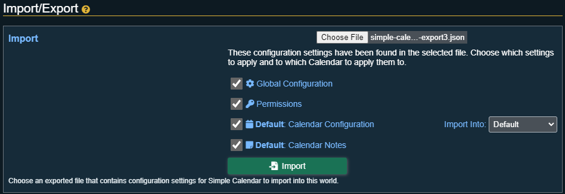

# Import / Export

This section is where users can go to import calendar configurations and/or notes into Simple Calendar, or export existing calendar configurations and/or notes out of Simple Calendar.

## Importing

The first step of importing a calendar configuration into Simple Calendar requires you picking a saved configuration file. These files are JSON files and will contain all the relevant information.

:::info
The import functionality supports configuration files from both **version 1.x** and **version 2.x** of Simple Calendar.
:::

After a configuration file has been selected a breakdown of what the files contains will be shown, as well as options on where to import those options into.

The breakdown contains:

| Option                 | Description                                                                                                                                                                                                                                                                                                                                                                                                                                                  |
|------------------------|--------------------------------------------------------------------------------------------------------------------------------------------------------------------------------------------------------------------------------------------------------------------------------------------------------------------------------------------------------------------------------------------------------------------------------------------------------------|
| Global Configuration   | Any of the global configuration options that were set can be imported if present in the configuration file.                                                                                                                                                                                                                                                                                                                                                  |
| Permissions            | Any of the permission options that were set can be imported if present in the configuration file.                                                                                                                                                                                                                                                                                                                                                            |
| Calendar Configuration | The name of the calendar will show before this option to show which calendar from the imported file this represents. If there is more than one calendar in the imported file they will all be shown.  You can also choose which calendar to import this configuration into or imported into a new calendar. Simple Calendar will attempt to match calendars of the same name together for quicker importing but this option can always been changed. |
| Calendar Notes         | The name of the calendar will show before this option to show which calendar from the imported file the notes are for. If there are more than one calendar in the imported file they will all be shown.  The notes will follow the rule for the  import into option of the same calendars configuration, importing into an existing calendar or a new one.                                                                                           |

All of these options are checkboxes, by default they are all checked but unchecking any of them will mean that option will not be processed during the import.

Once all selections have been made, clicking the import button will run the import and all calendars will be updated or added.

## Exporting

Like importing, exporting will show you a breakdown of all the different options that can be exported out of Simple Calendar.

| Option                 | Description                                                                                                                                                                         |
|------------------------|-------------------------------------------------------------------------------------------------------------------------------------------------------------------------------------|
| Global Configuration   | Export all the global configuration settings.                                                                                                                                       |
| Permissions            | Export all the permissions.                                                                                                                                                         |
| Calendar Configuration | The name of the calendar will show before this option to show which calendar configuration is being exported. If there is more than one calendar configured they will all be shown. |
| Calendar Notes         | The name of the calendar will show before this option to show which calendars notes are being exported. If there are more than one calendar configured they will all be shown.      |

All of these options are checkboxes, by default they are all checked but unchecking any of them will mean that option will not be included in the exported file.

Once all items that should be exported have been checked, clicking the export button will generate a JSON file that contains all the configuration details. This file can then be imported back into Simple Calendar to get the same configurations in different worlds.
