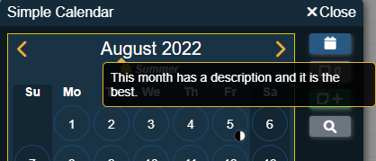
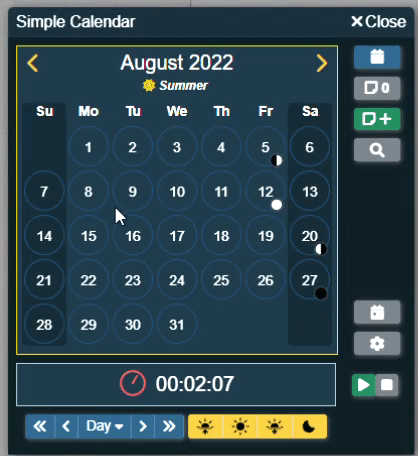
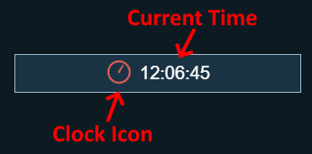
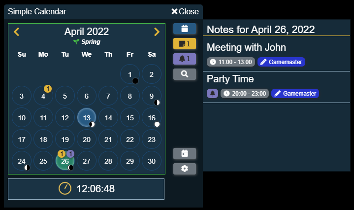
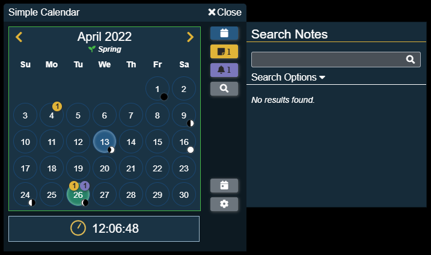

# Calendar View

The calendar view is the main way of interacting with Simple Calendar. The image below breaks the view into 3 main sections which will be further broken down individually. This will give you the best understanding of how to use Simple Calendar!

## Calendar

The calendar area shows a depiction of the current calendar in a way most people are familiar with. A month with days, broken down by weeks.

Within the calendar there are several parts that show or do different things.

### Month/Year

This is the text at the very top of the calendar that represents the current month and year being viewed. 

:::tip
This text can be customized by the **Gamemaster** using the [Month/Year Format display option](../calendar-configuration/display-options.md) for the specific calendar being used.
:::

If the Gamemaster has provided a description for this month, clicking the month name will open up an informational popup showing that description.

### Previous/Next Month Buttons

These buttons are used to view the previous or next month of the calendar. The rest of the calendar will change to reflect the information for the new month.

### Season Icon and Name

:::info
If **no seasons** have been configured for the calendar, this section will not show.
:::

This section will show the details about the current season. The current seasons name will appear and if an icon for that season has been [configured](../calendar-configuration/season-settings.md), that icon in the seasons color will appear before the seasons name.

If the Gamemaster has provided a description for this season, clicking the season name will open up an informational popup showing that description.

#### Border Color

The border color of the calendar will change the match the color of the current season.

### Weekdays

:::info
The display of weekdays can be **[turned off](../calendar-configuration/weekday-settings.md)**, so it may not show on all calendars.
:::

Above the list of days of the month is the abbreviated weekday names. 

If the Gamemaster has provided descriptions for the weekdays, clicking the weekday name will open up an informational popup showing that description.

### Day Highlights

- **Blue**: A day with a blue highlight represents the current date of the calendar.
- **Green**: A day with a green highlight represents the selected date of the calendar.

### Note Indicators

In the top right corner of a date can be a yellow and/or purple indicator with a number. These represent notes on that particular day.

- The yellow indicator are notes on the day that are visible to the current player.
- The purple indicator are notes on the day that the current player wants to be reminded of.

### Moon Phases

:::info
If **no moons** have been configured for the calendar no moon phases will be shown on the calendar.
:::

In the bottom right corner of a date is where the moon(s) phase for that date are shown. Phases are shown when:

- The phase for that day is a single day phase (new moon, full moon, first quarter moon or last quarter moon)
- For the current date (all moons current phase are shown)
- For the selected date (all moons current phase are shown)

If there are more than 2 moons to be shown the first moon's phase is shown with a down arrow, then hovering over that moon icon will reveal a popup that shows all the other moons phase for that date.

### Context Menu (Right Click Menu)

Each day on the calendar can be right-clicked (control-click on Mac) which will bring up a context menu with more details and actions for that day.

The menu shows the date for the clicked day as well as the sunrise and sunset times for that day.

:::info
If you have [permissions](../global-configuration/permissions.md) to change the date of the calendar you will see an option to set this day to the current date.
:::
:::info
If you have [permissions](../global-configuration/permissions.md) to add notes to the calendar you will see an option to add a new note to this day.
:::

## Clock

The clock displays the current time of day in the game as well as the status of the real time clock.

### Current Time

This is the text that represents the current time (hour, minute and seconds).

:::tip
This text can be customized by the **Gamemaster** using the [Time Format display option](../calendar-configuration/display-options.md) for the specific calendar being used.
:::

### Real Time Clock

Simple Calendar comes with the option for the Gamemaster to start a real time clock. This clock will advance the game time by a [configurable amount](../calendar-configuration/time-settings.md#clock-settings) for each second that passes in the real world. This is useful to keep games running and the suspense high.

#### Clock Icon

This icon represents the current state of the real time clock:

-  Red means the clock is stopped.
-  Yellow means the clock is paused.
-  Green and animated means the clock is running.

## Action Buttons

### Calendars

This button will open up the calendar panel that will show all calendars currently configured in Simple Calendar. More details on this panel under the [switching calendars documentation](switching-calendars.md).

:::info
This button will only display if there are **2 or more** [calendars configured](../calendar-configuration/add-remove-switch-calendar). 
:::

### Note Buttons

These buttons will open up a panel that will show the notes on the selected date. The yellow button indicates notes that the current player can see on the date while the purple button indicates note reminders for the current player on that date.

:::info
Be sure to check out [note list documentation](notes/index.md#note-list) for even more details on this panel!
:::

 

:::info
If you have [permissions](../global-configuration/permissions.md) to add notes to the calendar you will see an additional button for adding a new note to the current date.
:::

### Search Notes

This button will open up the note searching panel. More details on this panel under the [notes documentation](notes/index.md).  

### Today

This button will select the current date of the calendar and refresh the display to make sure it is visible.

### Configuration

This opens up the configuration options. Players will see a limited selection of options that pertain to them while Gamemaster's will see all the options.
