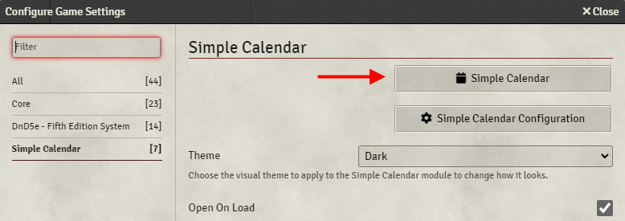

# Opening Simple Calendar

Simple Calendar comes with several different ways to open and close the main calendar window.

## Toolbar

The main way to open up Simple Calendar is through the button under Journal Notes. By default, this button just opens the calendar window but if the user has enabled the [Persistent Open Client Setting](client-settings.md#persistent-open) then this button will toggle the calendar window open and closed.

## Configure Settings

Simple Calendar can also be opened through the Configure Settings dialog of Foundry.

## On Load

Each player can also [choose if Simple Calendar opens by default](client-settings.md#open-on-load) when FoundryVTT is loaded.

## Keybinding

Simple Calendar also has a configurable keybinding for opening/closing the calendar window. By default, the key used is `Z` but this can be customized under [FoundryVTT's Configure Controls](https://foundryvtt.com/article/keybinds/) menu.
