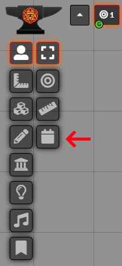
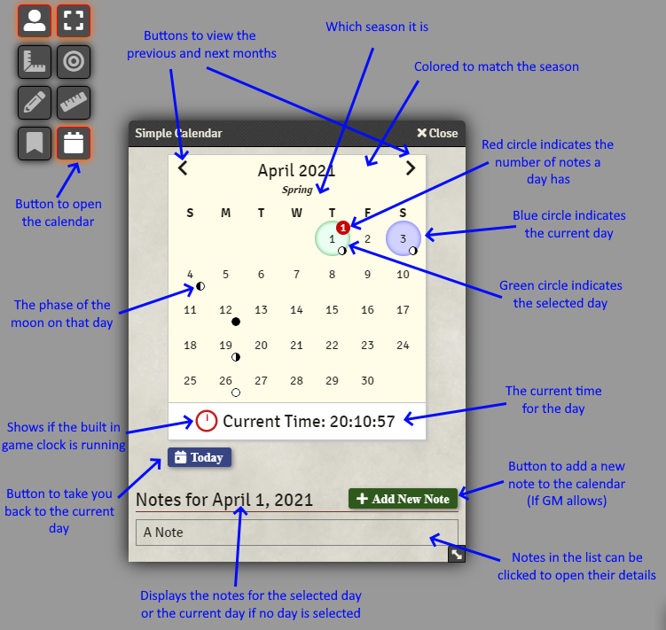

# Accessing and Using the Calendar

To access the calendar, a button has been added under the Token Controls left menu.

The module adds a calendar button to the basic controls section of the layer controls. Clicking on this will open the module window

The above image helps shows the controls, they are detailed out below.

Control | Description
------- | -----------
Previous/Next | Allow the user to change which month/year they are currently viewing.
Today Button | Changes the calendar so that the current day (in the game world) is visible and selected.
Current Day | A blue circle indicates the current day in the game world, can be changed by the GM
Selected Day | A green circle indicates the day the user currently has selected. This will show any notes on this day. Clicking on an all ready selected day will unselect the day.
Red Indicator | This shows on any days that have notes that the user can see. It will show the number of notes on that day up to 99.
Season Name | Appearing below the month and year if season are set up which season it current is will show.
Calendar Background Color | If seasons are set up the background color of the calendar will change to match which season is being viewed.
Moon Icons | Icons showing which phase of the moon will show on the bottom right of a day.
Current Time | If the GM wants to display a clock of the current game time it will appear below the calendar and show the current time of day.
Clock Icon | Next to the current time is a clock icon, this icon is used to indicate if the built in clock is running or not. More information [below](#simple-calendars-clock)!
Notes List | Any notes that appear in this list can be clicked on to open the note details.
Add New Note | If the GM allows players to add notes this button will appear in which a note can be added to the selected day.

### Compact View

Simple Calendar also has a compact view that shows just the current day and that days information.

To switch between the full and compact view you just need to double-click on the dialog's header!

## Simple Calendars Clock

Simple Calendar can now display a clock below the calendar. If the clock is not showing up, it is likely that the GM has turned off the clock for the current game as it will be not needed.

The clock can be updated manually by the GM, or it can be enabled to update as real world time passes. The amount of in game time that passes as real world time passes is configurable by the GM.

Once the clock has been started, it will begin incrementing time. The clock updates every 30 real life seconds, this is to allow time for proper syncing of the game time between all players.

The clock icon next to the Current Time display will also update based on the state of the Simple Calendars clock.

- **Red**: Means that Simple Calendars Clock is currently stopped and not automatically incrementing.
- **Yellow**: Means that Simple Calendars Clock has been started but because the game is paused OR there is an active combat the clock is not updating.
- **Green**: The clock will begin its animation, this means that Simple Calendars Clock is running and updating the game time as real time passes.
