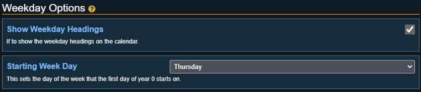

# Weekday Settings

This section displays all the weekdays that exist in the calendar. Weekdays are used to determine how wide the calendar display is.

## Show Weekday Headings

If checked the [calendar view](../using-sc/calendar-view) will show a row of weekday headings above the list of days. If unchecked these headings will be hidden.

## Starting Week Day

:::caution Important
This setting will be disabled if the [Pathfinder 2E: World Clock Sync](general-settings#pathfinder-2e-world-clock-sync) is enabled!
:::

This is used to select the day of the week that the first day of [year zero](year-settings#year-zero) starts on. This can be used to help adjust the calendar so the days line up with official calendars.

## Weekdays

With the options below you can configure each weekday for the calendar.

### Weekday Name

The full name of the weekday. This will show if configured in any of the [Date/Time Formatting](display-options#datetime-formatting) settings.

### Weekday Name Abbreviation

Set the abbreviated name for the weekday. This defaults to the first 2 letters of the weekdays name. This will show if configured in any of the [Date/Time Formatting](display-options#datetime-formatting) settings.

### Adding a New Weekday
Under the list of weekdays there is a button called "Add New Weekday". Clicking this button will add a new weekday to the list.

### Remove Weekday(s)
Next to each weekday is a remove button that will remove that specific weekday from the list. Under the list of weekdays there is a button called "Remove All Weekday" that will remove every weekday from the list.
