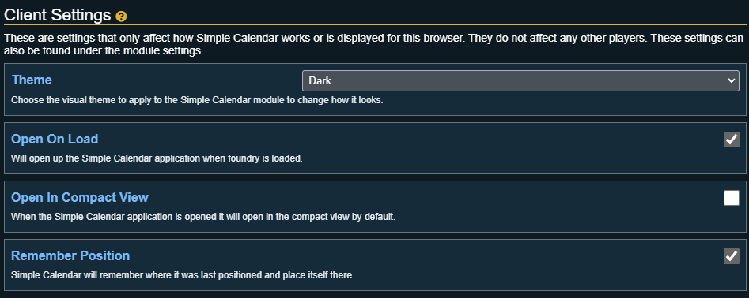

 # Client Settings

These are settings that affects how Simple Calendar works or is displayed for players using this browser. They do not affect any other players. These settings can also be found under FoundryVTT's module settings.

## Theme

Choose the visual theme to apply to the Simple Calendar module to change how it looks.

## Open on Load

Will open up the Simple Calendar application when foundry is loaded.

## Open In Compact View

When the Simple Calendar application is opened it will open in the compact view by default.

## Remember Position

Simple Calendar will remember where it was last positioned and place itself there.

## Always Show Note List

This setting will make it so the note list will always be visible and can not be closed. The only exception is if the calendar list or note search are opened they will open over top of the note list, but when closed the note list will remain visible.

## Persistent Open

When enabled this setting will remove the close button from the calendar window and prevent the escape key from closing it. The button under Journal Notes in the left toolbar then becomes a toggle to open and close the calendar.
