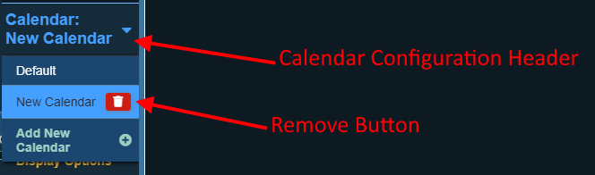

# Adding / Removing / Switching Calendars

## Add a New Calendar

Adding a new calendar to Simple Calendar is easy, just follow these steps:

1. Click on the calendar configuration header, this will show a list of configured calendars and options.

2. Click on the "Add New Calendar" option below the list of calendars.
3. This will take you to a new section where you can enter the name of the new calendar.

4. Click the "Add Calendar" button.
5. The new calendar will be created, and you will be taken to the [quick setup](quick-setup.md) section so a predefined calendar can be applied. If you don't want to use a predefined calendar you can skip this section and jump right into customization!

## Remove a Calendar

Removing a calendar from Simple Calendar is easy, just follow these steps:

1. Click on the calendar configuration header, this will show a list of configured calendar and options.

2. Click on the delete button next to the calendar name.
3. A dialog will appear asking if you are certain you want to remove the calendar, clicking the confirm button will then remove the calendar from Simple Calendar.

:::caution Important
The default calendar can not be removed as Simple Calendar requires at least 1 calendar to function. It can be customized, however.
:::

## Switch Calendars

Switching between calendar configurations in the Simple Calendar configuration dialog is easy, just follow these steps:

- Click on the calendar configuration header, this will show a list of configured calendar and options. 
- Click on the name of the calendar you want to view the configuration for.
- The calendar configuration header will update to show which calendar you are currently viewing.
