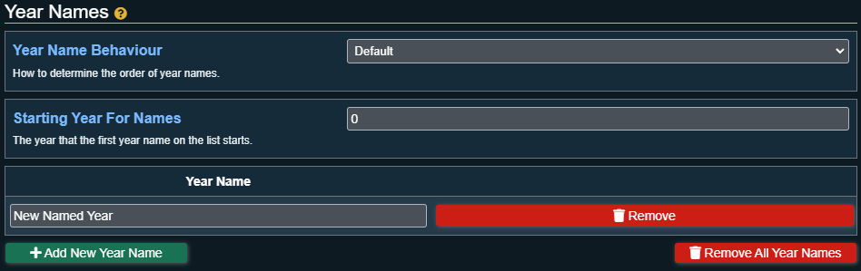

# Year Settings

This section shows all the settings for customizing details about the year.

## Current Year

The Current year of the calendar.

:::tip
If you need to change the date by many years you can quickly do that by changing this setting to the new year!
:::

## Year Prefix

Text that will appear before the year number if configured in any of the [Date/Time Formatting](display-options#datetime-formatting) settings.

## Year Postfix

Text that will appear after the year number if configured in any of the [Date/Time Formatting](display-options#datetime-formatting) settings.

## Year Zero

:::caution Important
This setting will be disabled if the [Pathfinder 2E: World Clock Sync](general-settings#pathfinder-2e-world-clock-sync) is enabled!
:::

This is the year that considered to be year zero for calculating how much time has passed.

Generally this setting will not need to be adjusted but is present for calendars that require a different year zero.

The best example of this is when calculating real world timestamps, the year 1970 is used as year zero.

## Year Names

With the options below you can configure how Simple Calendar will name years in the calendar. The names will appear if configured in any of the [Date/Time Formatting](display-options#datetime-formatting) settings.

### Year Name Behaviour

This drop down is used to determine how the year names are applied to years. The options are:

- **Default:** The year list starts at the specified starting year and goes down the list for each subsequent year. If the year is past the number of names in the list it will continue to use the last name from the list.
- **Repeat**: The year list starts at the specified starting year and goes down the list for each subsequent year. When the current year is past the name list length it will start again at the top of the list and repeat it forever.
- **Random**: For every year a random name from the list will be chosen. The calendar will do its best to keep the same name for a year.

### Starting Year For Names

This is the year that the first name in the list of Year Names is associated with.

This option only appears if the Year Name Behaviour setting is set to Default or Repeat.

### Year Name List

This is the list of different names that can be used for the years.  

#### Adding a New Year Name

Under the list of year names there is a button called "Add New Year Name". Clicking this button will add a new year name to the list.

#### Remove Year Name(s)

Next to each year name is a remove button that will remove that specific year name from the list. Under the list of year names there is a button called "Remove All Year Names" that will remove every year name from the list.
