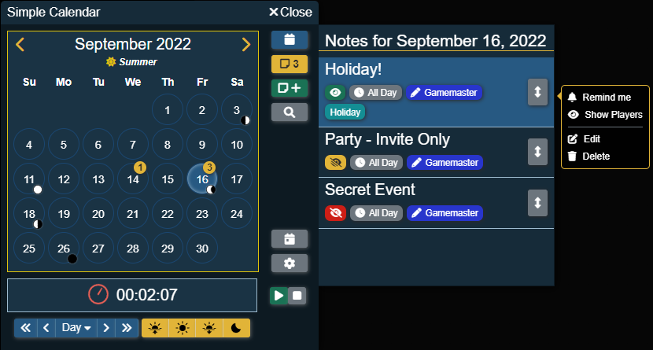
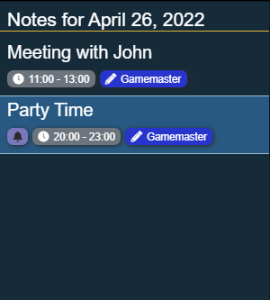

# Notes

Notes are great ways to add reminders or events to the calendar!

## Where Are They Saved?

Notes are stored as [journal entries](https://foundryvtt.com/article/journal/) in their own folder in the journal directory. By default, this folder is hidden from view but a Gamemaster [can enable it to be visible](../../global-configuration/settings.md) if they wish.

:::caution Important
Only notes in this folder will be read by Simple Calendar! If notes are moved from this folder they will not appear in the module.
:::

## Note List

To view the list of notes simply click on the Note Buttons in the [Action Buttons](../calendar-view.md#action-buttons) bar next to the calendar to open the note list.

:::tip
The note list can always be open by enabling the [Always Show Note List](../client-settings#always-show-note-list) client setting! Each player can configure this setting.
:::

This list shows all notes that are visible to the current player for the specified day. Each note will show the title as well as some quick details about the note. These details can be:

| Detail                               | Description                                                                                                                                                                                                                                                                                                                                                                                              |
|--------------------------------------|----------------------------------------------------------------------------------------------------------------------------------------------------------------------------------------------------------------------------------------------------------------------------------------------------------------------------------------------------------------------------------------------------------|
| Bell Icon                            | This will show on notes that the current player wants to be reminded about.                                                                                                                                                                                                                                                                                  |
| Time                                 | This will show what time the note takes place at on the day  or the text `all day` if the note doesn't have a specific time  or it will show a date range if the note takes place over multiple days.                                                     |
| Author                               | This will show who authored the note. If the author says `System` then the note was included as part of a predefined calendar.                                                                                                                                                                                                                                 |
| Categories                           | All of the note categories associated with the note will also be displayed.                                                                                                                                                                                                                                                                                  |
| Player Visible (Gamemaster Only) | This icon will show only for Gamemasters but indicate if a note is visible to all, one or more players or if only the Gamemaster(s) can see the note. The tooltip for this icon will show a list of which players can see the note.    |
| Macro Icon                           | This icon will show only for Gamemasters and authors of the note. It indicates if a macro has been set to trigger when the calendars date and time reach the notes date and time.                                                                                                                                                                               |
| Sorting Icon                         | If you are the Gamemaster or the Gamemaster has given a user role permission to change the order of notes on a day, there will be a sort icon displayed. Clicking this icon and dragging the note up or down will change the order the notes are displayed on that day.                                                                                       |

### Note List Context Menu (Right Click Menu)

You can right-click on notes under the notes list to show different actions that can be done. The list of actions available will change depending on if you are the Gamemaster or own the note being right-clicked on.

| Action                      | Who Can See            | Description                                                                                                                                                                                                                                           |
|-----------------------------|------------------------|-------------------------------------------------------------------------------------------------------------------------------------------------------------------------------------------------------------------------------------------------------|
| Remind Me / Don't Remind Me | Everyone               | A quick way to toggle being reminded about a note. For more details about note reminders view [this section](#note-reminders).                                                                                                                        |
| Show Players                | Gamemaster             | This functions the exact same as the [Show Players](https://foundryvtt.com/article/journal/#show) button in the header of a Journal Entry and allows a Gamemaster to show this note to the specified players regardless of if they can see it or not. |
| Edit                        | Gamemaster, Note Owner | Clicking this will open the note directly into [edit mode](editing.md).                                                                                                                                                                               |
| Delete                      | Gamemaster, Note Owner | Clicking this will open a confirmation dialog, to ensure that you do want to remove this note. Clicking the delete button in the confirmation dialog will remove the note. Check out the section on [removing notes](removing.md) for more details.   |

## Opening A Note

Opening a note is very simple, moving your mouse pointer over a note in the list of notes will change the background color. Clicking on that note will then open the [notes details](#note-details).

## Note Details

The note details dialog is a customized journal sheet that displays all the information about a note.

| Detail          | Description                                                                                                                                                                                                                                                                     |
|-----------------|---------------------------------------------------------------------------------------------------------------------------------------------------------------------------------------------------------------------------------------------------------------------------------|
| Note Title      | This is the title of the note.                                                                                                                                                                                                                                                  |
| Date and Time   | This shows the date and time of the note.                                                                                                                                                                                                                                       |
| Note Repeats    | If this note is set up to repeat (such as a yearly holiday) this will show how often the note is repeated.                                                                                                                                                                      |
| Note Author     | This shows who authored the note.                                                                                                                                                                                                                                               |
| Note Macro      | This will show only for Gamemasters and authors of the note. It indicates if a macro, and shows the name of that macro, has been set to trigger when the calendars date and time reach the notes date and time.                                                                 |
| Reminder Button | This button can be clicked to toggle if to be reminded about this note. A grey bell means no reminder, a green bell means remind me. For more details about note reminders view [this section](#note-reminders).                                                                |
| Note Categories | Any categories assigned to the note will be shown here.                                                                                                                                                                                                                         |
| Note Content    | This is the content of the note page that is currently selected.                                                                                                                                                                                                                |
| Note Pages      | The notes pages is a collapsible sidebar that show all of the pages associated with this note. If a note only has 1 page this sidebar will not appear when viewing the note.  Clicking a page title will replace the note content with the content of the page clicked. |
| Page Search     | This search box is used to filter down the list of pages based on the page title.                                                                                                                                                                                               |

## Note Reminders

Users can tell Simple Calendar that they would like to be reminded about certain notes when the in game time meets or passes the time of the note.

### Setting A Reminder

There are several ways to tell Simple Calendar you want to be reminded about a note!

#### When Creating A Note

When creating a new note you can specify that you want to be reminded about this note as you are filling out the note's information!

#### When Viewing A Note

When you are looking at the [note details](#note-details) clicking on the reminder button will tell Simple Calendar to remind you about this note!

#### Right-Clicking On A Note

When you right-click on a note in the [note list](#note-list) there will be an option to be reminded about that note!

### Getting A Reminder

Each player can customize how the reminder is sent to them by setting the [Note Reminder Notification](../client-settings.md#note-reminder-notification) option under the Client Settings.

