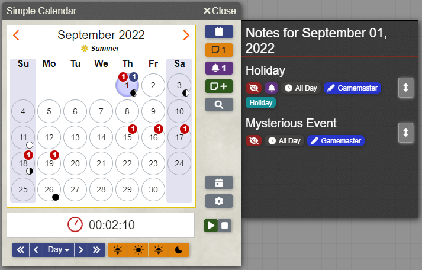

# Themes

Simple Calendar comes bundled with several themes for users to choose from. Each player can choose which theme they wish to use by changing the `Theme` setting under the [Client Settings](../global-configuration/settings.md#client-settings) section of the configuration.

## Global

These themes can be applied in any system and are always available to use.

The currently available global themes are:

### Dark

A dark mode or dark-colored theme.

### Light

A light mode or light-colored theme.

### Classic

A theme made to match the original look of Simple Calendar version 1.x. This theme also works well for systems that use the default look and feel of Foundry VTT.

## System Specific

These themes are designed to match a specific system as closely as possible. They are only available in that specific system because they borrow assets from that system.

The currently available system specific themes are:

### Das Schwarze Auge/The Dark Eye (5th Edition)

This theme is for the [Das Schwarze Auge / The Dark Eye (5th Edition)](https://foundryvtt.com/packages/dsa5) system.

This theme uses the styling of DSA's dialogs to make Simple Calendar look like it fits within the system.

### Eclipse Phase 2E

This theme is for the [Eclipse Phase 2E](https://foundryvtt.com/packages/eclipsephase) system.

This theme uses the styling of Eclipse Phases dialogs to make Simple Calendar look like it fits within the system.

### Forbidden Lands

This theme is for the [Forbidden Lands](https://foundryvtt.com/packages/forbidden-lands) system.

This theme uses the styling of Forbidden Lands dialogs to make Simple Calendar look like it fits within the system.

### Starfinder

This theme is for the [Starfinder](https://foundryvtt.com/packages/sfrpg) system.

This theme uses the styling of Starfinder's dialogs to make Simple Calendar look like it fits within the system.

### Warhammer 40,000 Roleplay: Wrath & Glory

This theme is for the [Warhammer 40,000 Roleplay: Wrath and Glory](https://foundryvtt.com/packages/wrath-and-glory) system.

This theme uses the styling of Wrath & Glory's dialogs to make Simple Calendar look like it fits within the system.

### Warhammer Fantasy Roleplay 4th Edition

This theme is for the [Warhammer Fantasy Roleplay 4th Edition](https://foundryvtt.com/packages/wfrp4e) system.

This theme uses the styling of Warhammer Fantasy Roleplay dialogs to make Simple Calendar look like it fits within the system.

## Module Specific

These themes are designed to match a specific module, usually a module that changes the entire look/feel of foundry. They are only available if that module is installed and active as they will borrow assets from that module.

There are currently no module specific themes in Simple Calendar.
